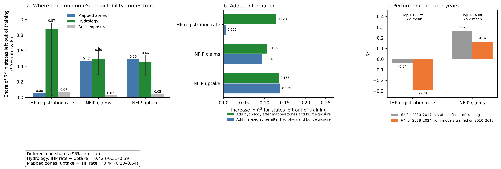
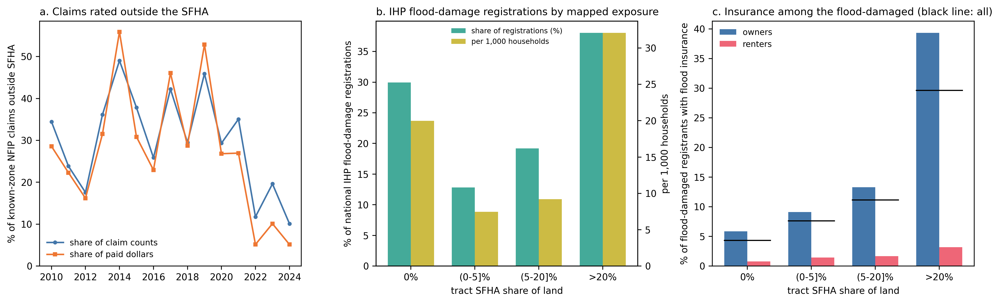
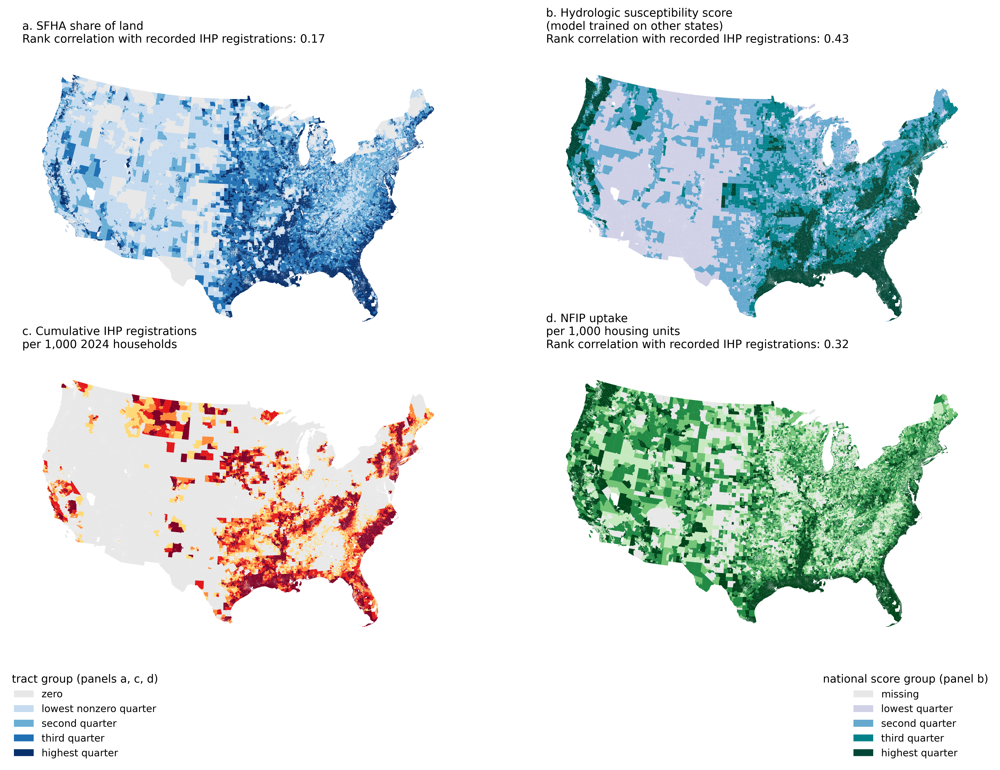
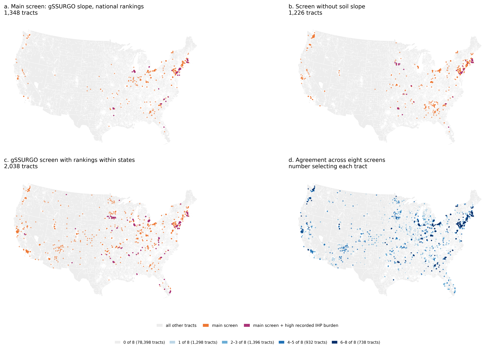

# Hydrologic determinants of flood insurance

This repository is the lean reproduction package for **“Mapped flood zones track U.S. flood insurance uptake more closely than recorded flood burden.”** The study compares mapped flood-zone exposure, hydrologic conditions, and built exposure across 83,360 census-tract observations in the 50 states and District of Columbia.



## What the study finds

In models that evaluate each tract using states excluded from training, mapped flood-zone measures account for about 50% of the variation explained in National Flood Insurance Program (NFIP) uptake but 6% of the variation explained in the declaration-conditioned Federal Emergency Management Agency (FEMA) Individuals and Households Program (IHP) registration rate. Hydrologic measures account for 87% of the variation explained in the IHP rate, although the interval for the difference between its IHP and uptake shares includes zero.

An exploratory screen identifies 1,348 tracts with a high hydrology-and-exposure score, no more than 5% of land in a Special Flood Hazard Area, and NFIP uptake in the lowest national fifth. These tracts contain an estimated 4.82 million people and 2.14 million housing units. Their mean IHP registration rate is 2.78 times the sample mean. The screen identifies a policy-relevant pattern; it is not an independent damage label or a causal estimate.

## Reproduce the primary results

The package includes a deidentified analysis-ready Parquet file, the complete primary model script, reference results, and validation checks.

```bash
conda env create -f environment.yml
conda activate cecreh-hydrologic-reproduction
python scripts/run_all.py --threads 4
```

The run fits 21 state-grouped XGBoost models, computes the three-block Shapley decomposition, performs a 500-repetition state-cluster evaluation bootstrap, reconstructs the primary screen, and compares the new outputs with the reference results. Outputs are written to `results/generated/`.

See [docs/REPRODUCING.md](docs/REPRODUCING.md) for expected values, output definitions, and troubleshooting.

## Package scope

This package reproduces the primary national model comparison and screening result from the included analysis-ready file. It does not redistribute applicant-level FEMA records, direct tract identifiers, source-record counts, payment amounts, or the hundreds of gigabytes of public geospatial inputs used in the full source-to-analysis build.

The source inventory and transformation chain are documented in [docs/DATA_PROVENANCE.md](docs/DATA_PROVENANCE.md). The release boundary is documented in [docs/DATA_RELEASE.md](docs/DATA_RELEASE.md), and all 39 released fields are described in [data/VARIABLES.csv](data/VARIABLES.csv).

## Repository contents

```text
data/                  Deidentified analysis-ready data and field dictionary
docs/                  Reproduction, provenance, and release documentation
figures/               Publication-facing project figures
results/reference/     Expected primary outputs
scripts/               Reproduction, release-build, and verification code
environment.yml        Pinned software environment
```

Working notes, review records, logs, machine-specific paths, and draft manuscript files are outside the release surface.

## Selected figures

| Recorded damage beyond mapped zones | Four national flood geographies |
|:---:|:---:|
|  |  |



## Authors and acknowledgment

Jesse R. Andrews and Ali Nejat. This work was developed through the Center of Excellence in Capacity-building for REsilient Housing (CECREH).

If you use this package, cite it using [CITATION.cff](CITATION.cff). Upstream datasets remain subject to their providers’ terms and attribution requirements.
